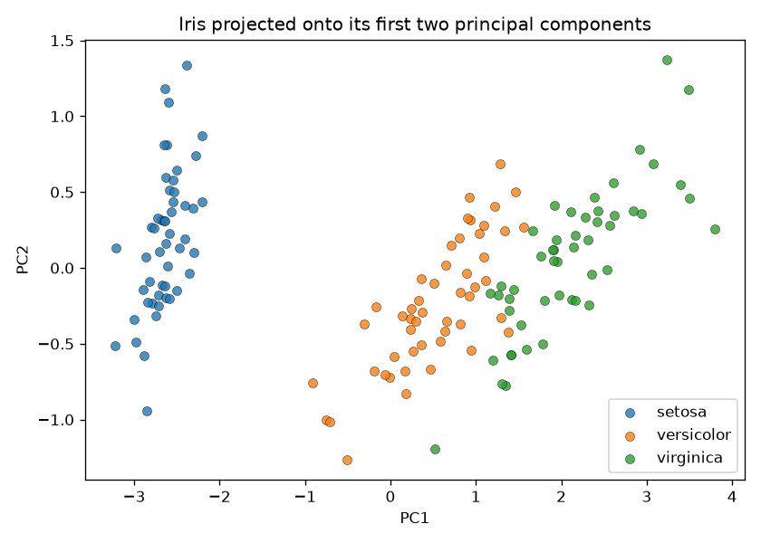

# PCA from Scratch on Iris — `covariance → eigen → project`

Principal Component Analysis built by hand and verified against
`sklearn.decomposition.PCA`. This is the payoff of [`eigen/`](../eigen/README.md):
the principal axes of a dataset are just the **eigenvectors of its covariance
matrix**, and the variance along each is the **eigenvalue**.

## The SVD / eigen intuition

A dataset is a cloud of points. Its **covariance matrix** describes the shape of
that cloud — which directions it spreads along and by how much:

- **eigenvectors** of the covariance matrix → the principal axes (directions of
  spread)
- **eigenvalues** → the variance along each axis

PCA rotates the data onto those axes and keeps the few with the most variance.
**SVD** does the same in one numerically-stable step: `X = U S Vᵀ`, where the rows
of `Vᵀ` *are* the principal axes and the singular values relate to eigenvalues by
`λᵢ = sᵢ² / (n − 1)`.

## What it does

`pca.py`:

1. **PCA by hand** — `pca_by_hand(X)`: center the data → covariance matrix
   (`np.cov`) → eigen-decomposition (`np.linalg.eigh`, since covariance is
   symmetric) → sort by eigenvalue → project onto the top-2 axes.
2. **Verify vs sklearn** — matches `explained_variance_`,
   `explained_variance_ratio_`, and the projected scores against
   `sklearn.decomposition.PCA` (after aligning each axis's arbitrary sign, since an
   eigenvector is only defined up to `±`).
3. **Plot** — projects 4-D Iris down to 2-D and saves `iris_pca.png`.

## Run

From the repo root (see the [root README](../README.md) for one-time venv setup):

```bash
.venv/bin/python pca/pca.py
```

## Sample output

```
STEP 1 — PCA by hand vs sklearn.decomposition.PCA
explained variance (by hand): [4.2282 0.2427]
explained variance (sklearn): [4.2282 0.2427]
    match: True
explained-variance ratio (by hand): [0.9246 0.0531]
explained-variance ratio (sklearn): [0.9246 0.0531]
    match: True
projected scores match sklearn (after sign-align): True

PC1 captures 92.5% and PC2 5.3% of the TOTAL variance (97.8% in just 2 of 4 dims).

STEP 2 — Project 4-D Iris down to 2-D and plot
saved plot -> pca/iris_pca.png
```



## Takeaway

Hand-built PCA reproduces sklearn exactly — same eigenvalues, same variance
ratios, same projected points (up to the sign each axis is free to take).

The result: four correlated measurements collapse to **two axes that hold 97.8% of
the variance**, and the three species still separate cleanly — PC1 alone carries
most of what distinguishes them. That is dimensionality reduction: throw away the
directions with little variance, keep the structure. The whole method is just
`eigen/` applied to a covariance matrix.
