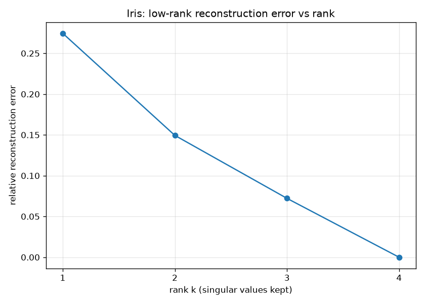

# PCA via SVD Directly — `X = U S Vᵀ` + Low-Rank Reconstruction

The [`pca/`](../pca/README.md) experiment took the **covariance route** (center →
covariance → eigen-decompose). SVD reaches the **same principal axes** in one
numerically-stable step, without ever forming the covariance matrix — and then
gives the thing it is truly famous for: the best low-rank approximation of a
matrix.

## The connection

For centered data `X`:

```
X = U S Vᵀ
```

- rows of `Vᵀ` **are** the principal axes (right-singular vectors)
- singular values relate to covariance eigenvalues by `λᵢ = sᵢ² / (n − 1)`
- `U S` **are** the projected scores (identical to `X @ Vᵀᵀ`)

So PCA and SVD are two doors to the same room. SVD is the door numerical libraries
actually use (sklearn's `PCA` runs an SVD under the hood) because forming the
covariance matrix squares the condition number and loses precision.

## What it does

`svd.py`:

1. **Three routes agree** — computes eigenvalues via `sᵢ²/(n−1)` from
   `np.linalg.svd`, via `np.linalg.eigh` on the covariance matrix, and via
   `sklearn.decomposition.PCA`, and shows all three match (plus the projected
   scores, after sign-alignment).
2. **Low-rank reconstruction (Eckart–Young)** — rebuilds Iris from the top-k
   singular triplets, reporting variance captured and relative reconstruction
   error at each rank, and plots error vs rank (`iris_svd_reconstruction.png`).

## Run

From the repo root (see the [root README](../README.md) for one-time venv setup):

```bash
.venv/bin/python svd/svd.py
```

## Sample output

```
STEP 1 — PCA via SVD  ==  covariance route  ==  sklearn.PCA
eigenvalues  s^2/(n-1)  [SVD]     : [4.2282 0.2427]
eigenvalues  of covariance [eigh] : [4.2282 0.2427]
explained_variance_       [sklearn]: [4.2282 0.2427]
    SVD == covariance route : True
    SVD == sklearn          : True
    projected scores match sklearn (sign-aligned): True

STEP 2 — Best rank-k reconstruction of the data (Eckart–Young)
rank 1: variance captured  92.5%   relative reconstruction error 0.2746
rank 2: variance captured  97.8%   relative reconstruction error 0.1494
rank 3: variance captured  99.5%   relative reconstruction error 0.0722
rank 4: variance captured 100.0%   relative reconstruction error 0.0000
```



## Takeaway

The SVD route reproduces the covariance route and sklearn exactly — `λᵢ = sᵢ²/(n−1)`
is the bridge between "singular values" and "variance."

Beyond PCA, SVD gives the **provably-best rank-k approximation** of any matrix
(Eckart–Young): rank 2 already rebuilds Iris to ~85% fidelity, rank 3 to ~93%.
That single fact underpins PCA, image compression, noise reduction, and
latent-factor / recommender models — keep the largest singular values, discard the
rest.
